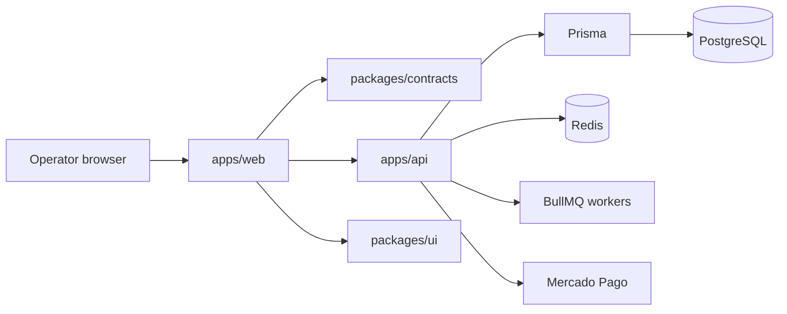

# VOWGRID-API

VowGrid is the trust layer between AI agents and real-world actions.

Case study: https://saviocodes.github.io/saviofilho.dev/work/vowgrid-api/

Core product flow:

`Propose -> Simulate -> Evaluate Policy -> Approve -> Execute -> Generate Receipt -> Rollback visibility`

## Architecture At A Glance



## Current Reality

- The core trust workflow is implemented through receipt generation, audit visibility, queue-backed execution, and queue-backed rollback.
- Dashboard auth is now real: email/password signup and login create a session-backed dashboard experience.
- API keys exist as the machine-to-machine auth path and can now be created, rotated, and revoked from the dashboard.
- Billing is implemented internally with launch pricing, a backend-managed 14-day trial, usage tracking, entitlements, and Mercado Pago provider integration foundations.
- Provisional data still exists, but only behind the explicit dev-only `/preview` route when enabled.
- CI now validates typecheck, lint, unit tests, integration tests, coverage, build, and an E2E smoke path.

## Monorepo

```text
vowgrid/
|-- apps/
|   |-- api/   Fastify API, Prisma schema, auth, billing, BullMQ worker
|   `-- web/   Next.js site, auth pages, and protected control plane
|-- packages/
|   |-- contracts/ Shared Zod schemas and API types
|   `-- ui/        Shared UI primitives
|-- docs/          Run guides, reports, backend, design, and billing docs
`-- infra/         Docker Compose for Postgres and Redis
```

## Quick Start

1. Install dependencies with `pnpm install`.
2. Copy `apps/api/.env.development.example` to `apps/api/.env`.
3. Copy `apps/web/.env.development.example` to `apps/web/.env.local`.
4. Optionally copy `infra/.env.development.example` to `infra/.env` if you need custom Docker ports or credentials.
5. Start Docker Desktop, then run `pnpm docker:up`.
6. Apply migrations with `pnpm migrate`.
7. Seed local data with `pnpm seed`.
8. Start the API with `pnpm dev:api`.
9. Start the web app with `pnpm dev:web`.

Or use the unified dev command:

- `pnpm start:dev`

Local URLs:

- Web: `http://localhost:3000`
- API: `http://localhost:4000`
- Swagger: `http://localhost:4000/v1/docs`

Seeded local access:

- Dashboard email: `reviewer@vowgrid.local`
- Dashboard password: `vowgrid_local_password`
- API key: `vowgrid_local_dev_key`

## Common Scenarios

### Human operator path

1. Sign up at `/signup` or log in at `/login`.
2. Review the control plane at `/app`.
3. Manage programmatic API keys from `/app/settings`.
4. Review billing, usage, and trial state from `/app/billing`.

### Machine-to-machine path

```bash
curl -H "X-Api-Key: vowgrid_local_dev_key" \
  http://localhost:4000/v1/intents?pageSize=5
```

### End-to-end trust workflow

See `docs/REAL_WORLD_SCENARIOS.md` for common intent, billing, and enterprise paths.

## Auth Model

- Human dashboard access uses session-backed auth through `/v1/auth/signup`, `/v1/auth/login`, `/v1/auth/me`, and `/v1/auth/logout`.
- The web app stores the session token in an HttpOnly cookie named `vowgrid_dashboard_session`.
- Protected product routes live under `/app`.
- API keys remain the direct auth layer for programmatic clients.

## Billing Snapshot

| Plan       | Monthly        | Yearly         | Executed actions / month | Intents / month | Self-serve checkout |
| ---------- | -------------- | -------------- | ------------------------ | --------------- | ------------------- |
| Launch     | `R$ 79`        | `R$ 790`       | `300`                    | `2,000`         | Yes                 |
| Pro        | `R$ 249`       | `R$ 2,490`     | `3,000`                  | `15,000`        | Yes                 |
| Business   | `R$ 799`       | `R$ 7,990`     | `20,000`                 | `100,000`       | Yes                 |
| Enterprise | `Sob consulta` | `Sob consulta` | Custom                   | Custom          | No                  |

Launch billing notes:

- Free trial: `14` days, managed internally by the VowGrid backend
- Primary commercial metric: executed actions per month
- Secondary usage guardrail: intents per month
- No automatic overage billing in this release
- Enterprise remains sales-assisted

## Useful Commands

- `pnpm typecheck`
- `pnpm lint`
- `pnpm build`
- `pnpm test`
- `pnpm test:integration`
- `pnpm test:coverage`
- `pnpm test:e2e`
- `pnpm migrate`
- `pnpm seed`
- `pnpm docker:up`
- `pnpm docker:down`
- `pnpm docker:status`
- `pnpm docker:logs`

## Documentation

Current docs:

- `docs/ARCHITECTURE.md`
- `docs/TECH_CHOICES.md`
- `docs/ENVIRONMENT_STRATEGY.md`
- `docs/DEPLOYMENT_FLOW.md`
- `docs/TROUBLESHOOTING.md`
- `docs/REAL_WORLD_SCENARIOS.md`
- `docs/ROADMAP.md`
- `docs/RUN_GUIDE.md`
- `docs/AUTH_SETUP.md`
- `docs/IMPLEMENTATION_STATUS.md`
- `docs/PROJECT_AUDIT_REPORT.md`
- `docs/billing/BILLING_ARCHITECTURE.md`
- `docs/billing/PRICING_STRATEGY.md`
- `docs/billing/MERCADO_PAGO_SETUP.md`
- `docs/billing/ENTITLEMENTS_AND_LIMITS.md`
- `docs/backend/API_OVERVIEW.md`
- `docs/backend/DOMAIN_MODEL.md`
- `docs/backend/STATUS.md`

Historical reports:

- `docs/FINAL_INTEGRATION_REPORT.md`
- `docs/FRONTEND_INTEGRATION_REPORT.md`
- `docs/BILLING_UPDATE_REPORT.md`
- `docs/handoffs/*`

## Known Limitations

- Enterprise still depends on a configured contact inbox and manual commercial handling.
- Mercado Pago checkout still requires real provider env configuration.
- Password reset, email verification, invites, SSO, and multi-workspace membership are not implemented.
- Deploy automation to staging/production and Infrastructure as Code are not implemented yet.
