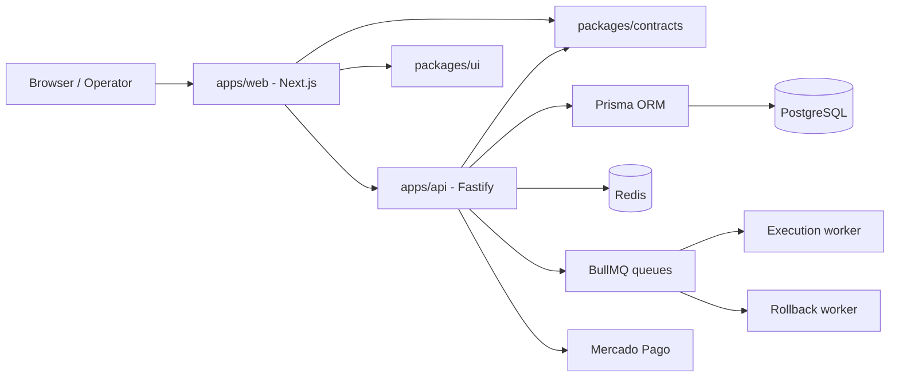
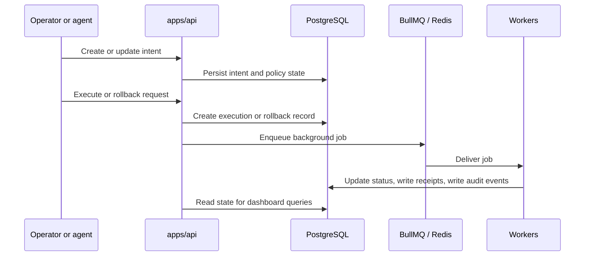

# Architecture

## Layer diagram

## Request flow

1. Human operators use `apps/web`.
2. The web app uses shared contracts to call `apps/api`.
3. The API persists workflow state in Postgres through Prisma.
4. Execution and rollback are delegated to BullMQ-backed workers.
5. Billing truth stays internal; Mercado Pago is only the provider adapter.

## Workflow and queue flow

## Event-driven boundaries

- HTTP requests remain the entry point for user and machine actions.
- Execution and rollback become background jobs as soon as the product crosses into asynchronous side effects.
- Audit events and receipts are persisted as product truth, not as transient logs.
- Mercado Pago webhook events are normalized into internal billing state before the dashboard reads them.

## Boundaries

- `apps/api`: business rules, auth, billing, queue orchestration, audit truth
- `apps/web`: product UI, dashboard auth UX, pricing, settings, live session-backed integration
- `packages/contracts`: shared request/response types and schemas
- `packages/ui`: reusable primitives only
- `infra`: local Postgres and Redis used by dev, CI, and integration testing
