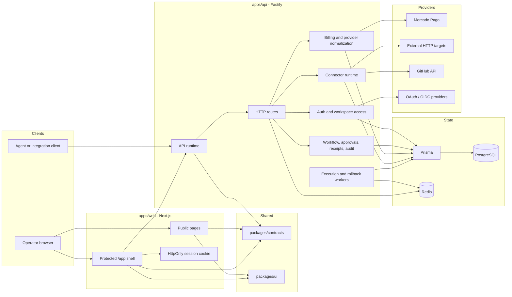
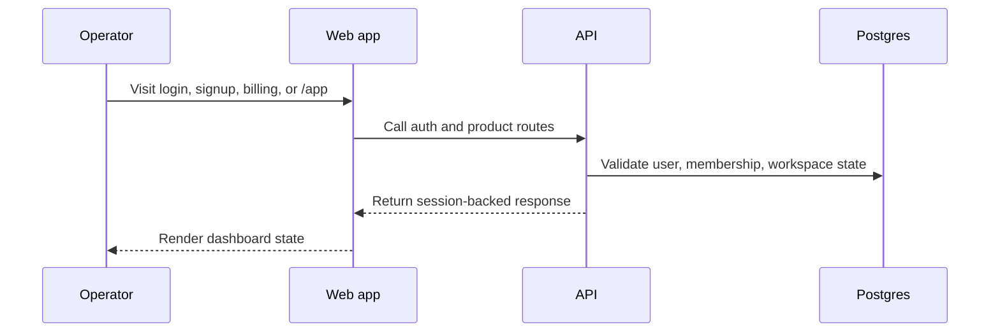
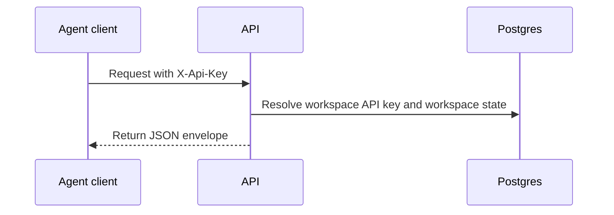
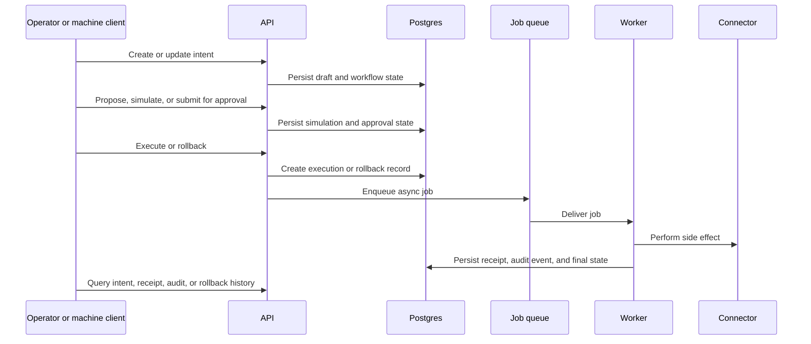
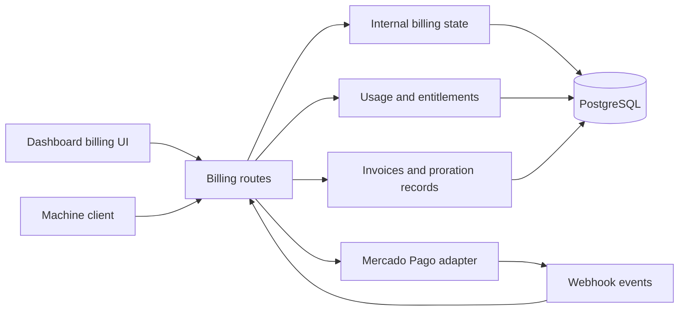

# Architecture

VowGrid is a monorepo that separates operator experience, machine access, workflow orchestration, billing, and infrastructure concerns without pretending those concerns are different products.

At a high level:

- humans use the Next.js dashboard in `apps/web`
- machine clients use the Fastify API in `apps/api`
- shared contracts live in `packages/contracts`
- shared UI primitives live in `packages/ui`
- workflow truth, auth state, billing state, receipts, and audit events live in Postgres
- asynchronous execution and rollback run through BullMQ on Redis

## System Map

## Monorepo Responsibilities

| Area                 | Responsibility                  | Notes                                                                               |
| -------------------- | ------------------------------- | ----------------------------------------------------------------------------------- |
| `apps/web`           | operator-facing product surface | marketing pages, login/signup, billing UI, workspace settings, protected `/app`     |
| `apps/api`           | product truth and orchestration | auth, intents, approvals, execution, rollback, billing, connectors, audit, receipts |
| `packages/contracts` | shared schemas and API types    | used by API and web to reduce drift                                                 |
| `packages/ui`        | shared UI primitives            | reused by the Next.js app only                                                      |
| `packages/sdk`       | typed TypeScript client         | machine-client helper, still credential-gated like the raw API                      |
| `infra`              | local and release topology      | Compose files, observability stack, deploy scripts, Terraform scaffold              |

## Access Model

VowGrid has two primary entry paths.

### Human operator path

- dashboard auth is session-backed
- the web layer stores an opaque session token in an `HttpOnly` cookie
- `/app` requires a valid session and does not silently fall back to provisional data
- `/preview` is the explicit provisional surface when enabled

### Machine client path

- machine access uses workspace API keys
- API keys are workspace-scoped, hashed at rest, and managed from the dashboard
- the same workflow engine serves both humans and machine clients

## Workflow Lifecycle

This is the core product path:

`Propose -> Simulate -> Evaluate Policy -> Approve -> Execute -> Generate Receipt -> Rollback visibility`

Important boundaries:

- HTTP stays synchronous until a request crosses into real external side effects
- execution and rollback become background jobs once queued
- receipts and audit events are persisted product records, not just logs
- worker processing is queue-backed, but workers are currently started by the API runtime rather than deployed as a separate worker fleet

## Connector Runtime

The current runtime registers:

- `mock`
- `http`
- `github`

Current truth:

- `mock` is the reference path for local development and verified flow testing
- `http` is the generic outbound webhook-style connector
- `github` supports a narrow operational action set
- Slack is intentionally not registered in the runtime today

See [Connector implementations](CONNECTOR_IMPLEMENTATIONS.md) for the support matrix and rollback expectations.

## Billing Architecture Slice

Billing principles:

- billing truth is internal to VowGrid
- provider payloads are normalized before the dashboard reads them
- plans, trials, entitlements, overage, coupons, tax profile controls, proration previews, and invoice records already exist
- Mercado Pago remains a provider adapter, not the billing source of truth

## Data And State Boundaries

| Store          | Role                                   | Examples                                                                                    |
| -------------- | -------------------------------------- | ------------------------------------------------------------------------------------------- |
| PostgreSQL     | durable product truth                  | users, sessions, workspace state, intents, approvals, receipts, audit events, billing state |
| Redis          | ephemeral queue and coordination state | BullMQ jobs, worker coordination, async job delivery                                        |
| Browser cookie | web session carrier                    | opaque dashboard session token                                                              |

## Trust Boundaries

- browser to web: public internet and operator-controlled device
- web to API: first-party application boundary
- API to database and Redis: trusted runtime boundary
- API or worker to provider: external side-effect boundary
- provider webhook back to API: untrusted external callback boundary normalized into internal state

## Design Principles

- one source of truth for workflow and billing state
- shared contracts instead of duplicated request shapes
- clear separation between human auth and machine auth
- queue-backed side effects instead of pretending external actions are synchronous
- documentation should describe the current launch-stage architecture, not a hypothetical platform

## What This Architecture Is Not

- not a multi-node platform
- not a dedicated worker cluster
- not a multi-region deployment
- not a managed-secrets architecture yet
- not a full enterprise federation platform yet

For runtime and deploy topology, see [Production blueprint](PRODUCTION_BLUEPRINT.md).
