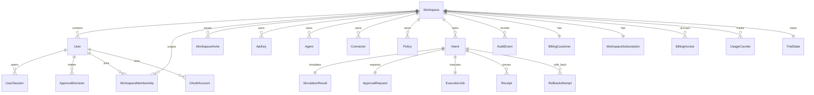

# Database Schema Guide

The canonical schema lives in:

- `apps/api/prisma/schema.prisma`

This document is the operator and developer map of that schema.

## Domain Groups

## Workspace And Identity

Primary models:

- `Workspace`
- `User`
- `WorkspaceMembership`
- `WorkspaceInvite`
- `UserSession`
- `ApiKey`
- `EmailVerificationToken`
- `PasswordResetToken`
- `OAuthAccount`
- `OAuthSignupToken`

Purpose:

- human identity
- workspace isolation
- invite acceptance
- multi-workspace membership
- machine credentials

## Billing

Primary models:

- `BillingCustomer`
- `WorkspaceSubscription`
- `BillingEvent`
- `BillingInvoice`
- `BillingInvoiceLineItem`
- `UsageCounter`
- `TrialState`

Purpose:

- plan catalog state
- trial lifecycle
- usage metering
- overage and proration records
- provider event history

## Workflow Core

Primary models:

- `Agent`
- `Intent`
- `SimulationResult`
- `Policy`
- `PolicyDecision`
- `ApprovalRequest`
- `ApprovalDecision`
- `ExecutionJob`
- `Receipt`
- `RollbackAttempt`
- `AuditEvent`
- `Connector`

Purpose:

- represent trusted actions
- model simulation and approval
- queue execution and rollback
- preserve receipts and audits

## Relationship Summary



## Key Constraints

- `Workspace.slug` is unique
- `User.email` is unique
- `WorkspaceMembership` is unique on `[userId, workspaceId]`
- `ApiKey.keyHash` is unique
- `UsageCounter` is unique on `[workspaceId, metric, periodStart]`
- `ApprovalRequest.intentId` is unique
- `ExecutionJob.intentId` is unique

## Important Indexed Access Patterns

The schema already favors these reads:

- workspace-scoped intent listing
- workspace-scoped membership listing
- usage by workspace and metric
- audit browsing by workspace and time
- session lookup by token hash
- API key lookup by hash

## Fields Worth Knowing

### `ApprovalRequest`

- `mode`
- `requiredCount`
- `currentCount`
- `currentStageIndex`
- `stageDefinitions`

This is what powers both single-step and multi-step approvals.

### `AuditEvent`

- `entityType`
- `entityId`
- `actorType`
- `actorId`
- `previousHash`
- `integrityHash`

This supports polymorphic audit browsing plus tamper-evident chaining.

### `Connector`

- `type`
- `config`
- `rollbackSupport`
- `enabled`

Connector config is encrypted before persistence.

## Migration Policy

Use Prisma migrations as the only schema mutation path:

```bash
pnpm generate
pnpm migrate
```

Avoid direct manual schema drift in live environments.

## Known Schema Gaps

Not yet modeled as first-class domains:

- enterprise contract management
- advanced tax compliance by jurisdiction
- full data-retention automation
- soft delete semantics across every entity
