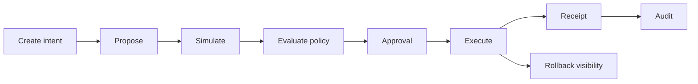

# Real World Scenarios

This document shows how VowGrid is intended to be used, with realistic operator and agent flows.

## Scenario 1: Controlled Production Secret Rotation



Example API sequence:

```bash
curl -X POST http://localhost:4000/v1/intents \
  -H "Content-Type: application/json" \
  -H "X-Api-Key: vowgrid_local_dev_key" \
  -d "{\"title\":\"Rotate support token\",\"action\":\"rotate_secret\",\"agentId\":\"cmg0000000000000000000002\",\"connectorId\":\"cmg0000000000000000000004\",\"environment\":\"production\"}"
```

Then:

1. `POST /v1/intents/:intentId/propose`
2. `POST /v1/intents/:intentId/simulate`
3. `POST /v1/intents/:intentId/submit-for-approval`
4. `POST /v1/approvals/:approvalRequestId/decisions`
5. `POST /v1/intents/:intentId/execute`
6. inspect receipt and audit trail

## Scenario 2: Programmatic Agent Integration

```bash
curl -X GET \
  http://localhost:4000/v1/intents?pageSize=5 \
  -H "X-Api-Key: <workspace-api-key>"
```

## Scenario 3: Human Operator Workflow In The Dashboard

1. sign up or log in
2. review `/app`
3. inspect billing, usage, approvals, and audit surfaces
4. manage members, invites, workspaces, and API keys in `/app/settings`
5. follow one intent from creation to receipt

## Scenario 4: Multi-step Approval Chain

Example staged approval:

- stage 1: operations review by `admin`
- stage 2: business sign-off by `member`

## Scenario 5: External HTTP Action

Use the `http` connector when the target system exposes a webhook-style endpoint.

Example config shape:

```json
{
  "url": "https://example.com/webhook",
  "rollbackUrl": "https://example.com/webhook/rollback",
  "headers": {
    "X-VowGrid-Test": "runtime"
  }
}
```

## Scenario 6: Lightweight GitHub Operational Action

Use the `github` connector for limited actions such as:

- `create_issue`
- `add_issue_comment`
- `close_issue`

## Scenario 7: Enterprise Sales-Assisted Onboarding

Enterprise is still manual by design:

1. customer reaches out through the configured CTA
2. requirements are reviewed
3. billing and support posture are negotiated
4. workspace is provisioned manually
5. the customer receives onboarding instructions
